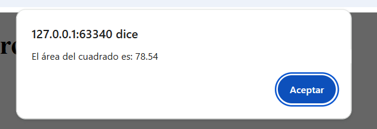

# ABP M3 - Ejercicios

Este repositorio contiene los ejercicios desarrollados para el módulo 3.

## Ejercicios creados

### Ejercicio 1: Calcular área de un círculo

- Archivo principal: `ejercicio1.html`
- Script: `assets/js/ejercicio1.js`
- Descripción: solicita al usuario el radio de un círculo y calcula el área usando la fórmula `π × radio²`.
- Interacción: al hacer clic en el botón **Iniciar**, se muestra un `prompt` para ingresar el radio y luego un `alert` con el resultado.

## Archivos del proyecto

- `ejercicio1.html`: página principal del ejercicio.
- `assets/js/ejercicio1.js`: lógica de cálculo y validación de la entrada.

## Evidencias

1.- Evenidencia: Resultado del área del circulo:

